
 
  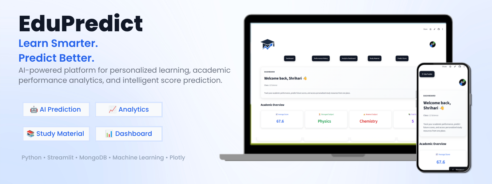

<h1 align="center">🎓 EduPredict</h1>

<b>Learn Smarter. Predict Better.</b>

AI-powered student performance prediction platform built using Streamlit, MongoDB and Machine Learning.

---

## 🚀 Features

### 🔐 User Authentication

* Secure Login & Signup System
* Password Encryption
* User Profile Management
* Profile Picture Support

### 📊 Performance Analytics

* Subject-wise Score Tracking
* Academic Performance Visualization
* Strongest Subject Identification
* Focus Area Detection
* Average Score Analysis

### 🤖 AI Score Prediction

* Machine Learning-based Score Prediction
* Subject-wise Future Performance Estimation
* Personalized Academic Insights

### 📚 Personalized Learning Support

* Class-wise Subject Management
* Smart Recommendations Based on Performance
* Study Material Access

### 👤 Profile Management

* Editable User Information
* Username Management
* Class Selection
* Profile Avatar Support

### 📈 Dashboard Features

* Interactive Navigation Bar
* Welcome Dashboard
* Performance History Section
* AI Prediction Section
* Study Material Section
* User Profile Section

---

# 📷 Application Preview

## 💻 Desktop

### Landing Page

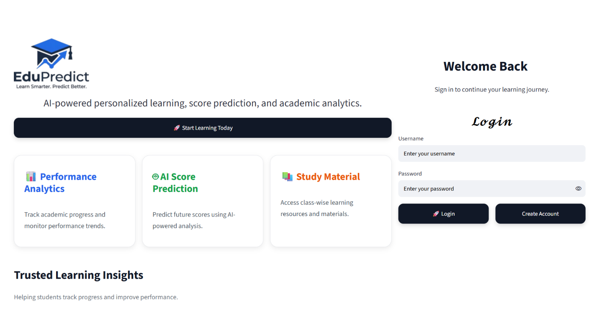

### Dashboard

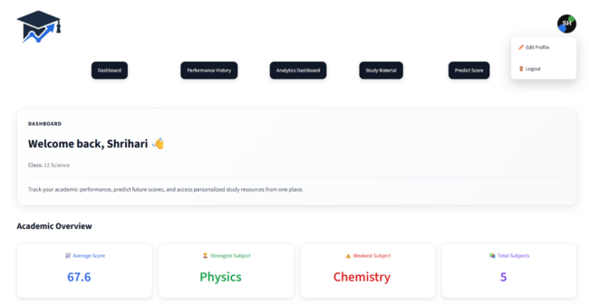

### Performance History

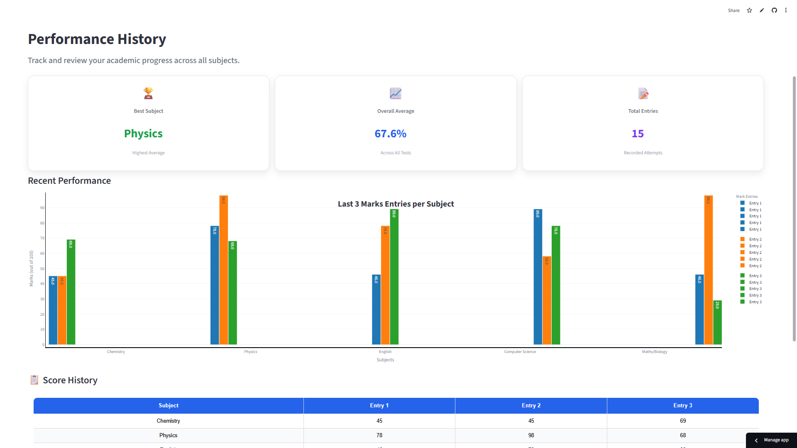

### Analytics Dashboard

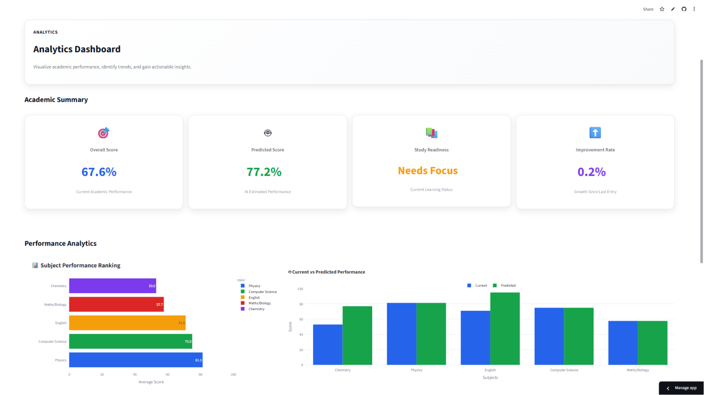

### AI Prediction

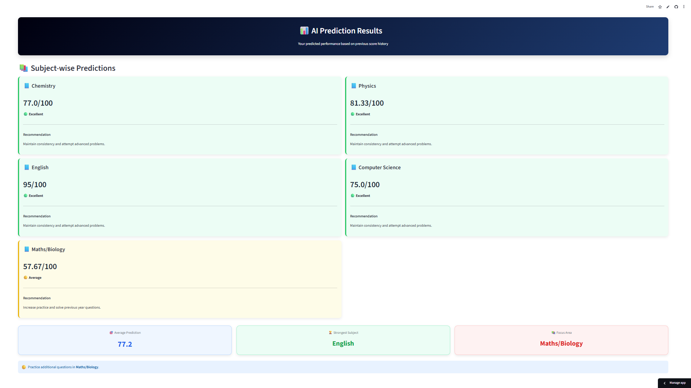

### Study Material

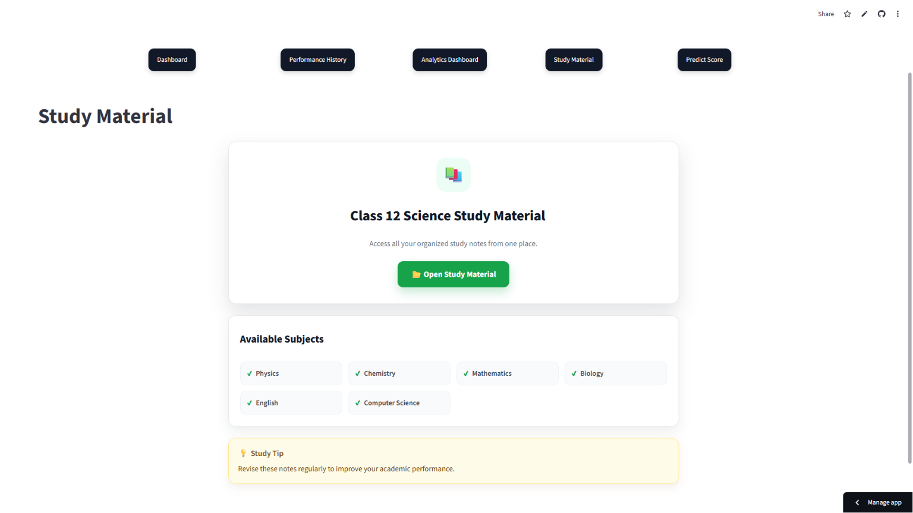

----

## 📱 Mobile

### Landing Page

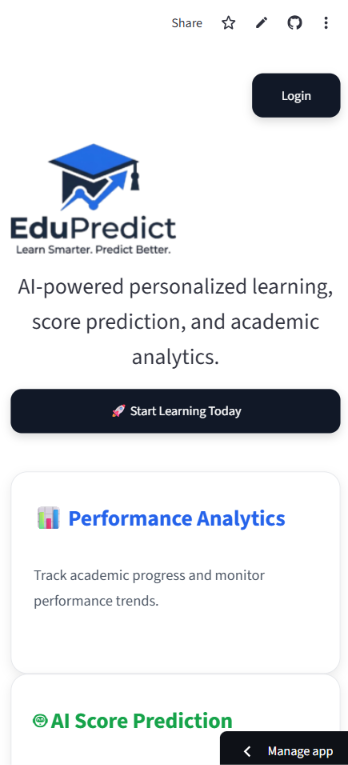

### Dashboard

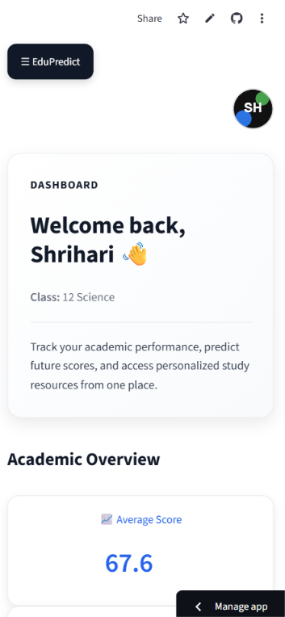

### Navigation

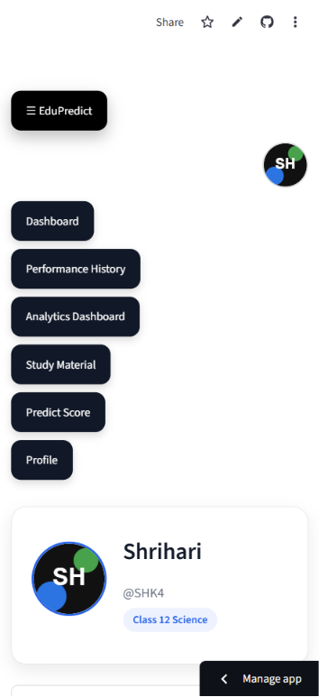

### Profile Management

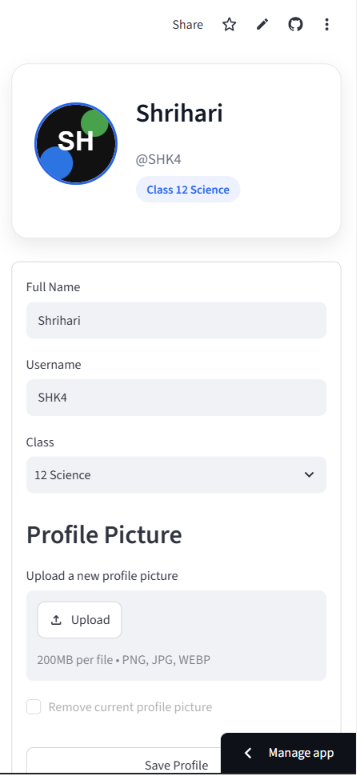

---

## 🛠️ Technology Stack

### Frontend

* Streamlit
* HTML
* CSS

### Backend

* Python

### Database

* MongoDB

### Machine Learning

* Scikit-Learn
* NumPy
* Pandas

### Authentication & Security

* Password Hashing
* Session Management

---

## 🎯 Why EduPredict?

* Help students monitor academic progress.
* Predict future examination performance.
* Identify strengths and weaknesses.
* Provide personalized educational guidance.
* Improve learning outcomes using AI.

---

## 🏗 System Architecture

### 1. Authentication Module

Handles user registration, login, profile management, and session handling.

### 2. Performance Tracking Module

Stores and analyzes subject-wise academic records.

### 3. Prediction Engine

Uses machine learning algorithms to predict future scores based on previous performance.

### 4. Recommendation System

Provides guidance and learning suggestions based on user performance.

### 5. Dashboard Module

Offers a centralized interface for analytics, predictions, and profile management.

---

## 🎨 User Interface Highlights

* Modern Landing Page
* Professional Dashboard Layout
* Feature Cards
* Performance Metrics
* Responsive Navigation System
* Personalized Welcome Experience

---

## 🔮 Future Enhancements

* PDF Progress Reports
* Advanced Recommendation Engine
* Email Notifications
* Admin Dashboard
* Learning Path Generation
* Google Authentication
* Two-Factor Authentication (2FA)
* PDF Report Generation

---

## 👨‍💻 Developer

**Shrihari H Kulkarni**

Computer Science Engineering Student

---

⭐ If you found this project useful, consider giving it a star on GitHub.

---

EduPredict © 2026

*"Learn Smarter. Predict Better."*

----

## 📄 License

This project is intended for educational and portfolio purposes.

© 2026 Shrihari H Kulkarni. All Rights Reserved.
